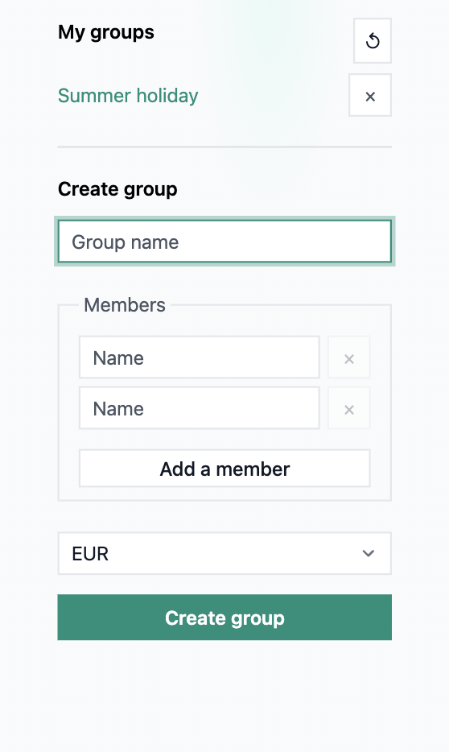
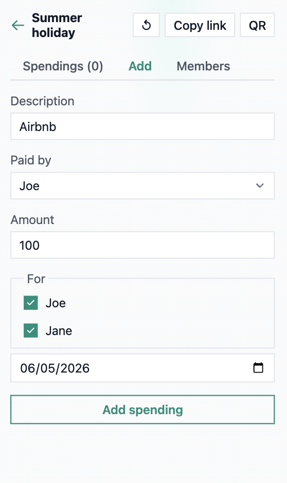
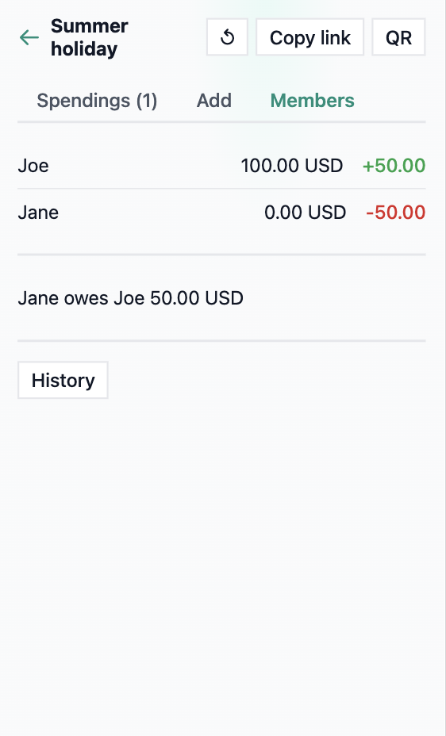

Shared expense tracker. No accounts, just link sharing.

### [Try it at `count.yann.md`](https://count.yann.md)


---

Data is stored on persistent redis, while your browser remembers the groups you created or joined.

Very low hardware requirements, docker-ready, built-in rate-limiting.

Translated fr/en


View your groups or create one | Add spending, share via link or QR |  Equalize 
:-------------------------:|:-------------------------:|:-------------------------:
  |   | )

## Run locally

With uv: `./dev.sh`

With pip:
```sh
pip install -e ".[dev]"
cd backend && uvicorn main:app --reload
```

## Deploy

```sh
docker compose up -d
```

Set `REDIS_URL` for persistence. Set `RATE_LIMIT` (requests/minute per IP, default 120).

## Stack

FastAPI, Jinja2, Vanilla JS, Redis

## Licence

GPLv3
